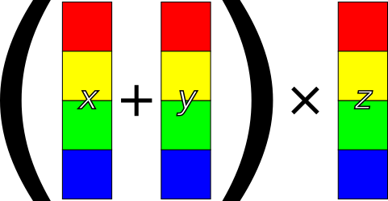
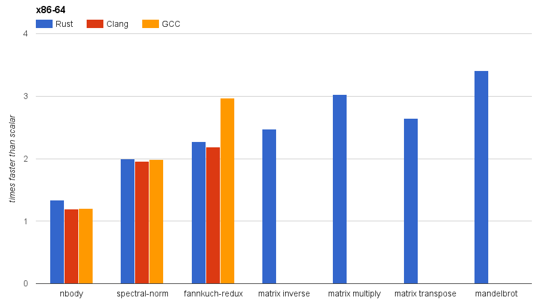
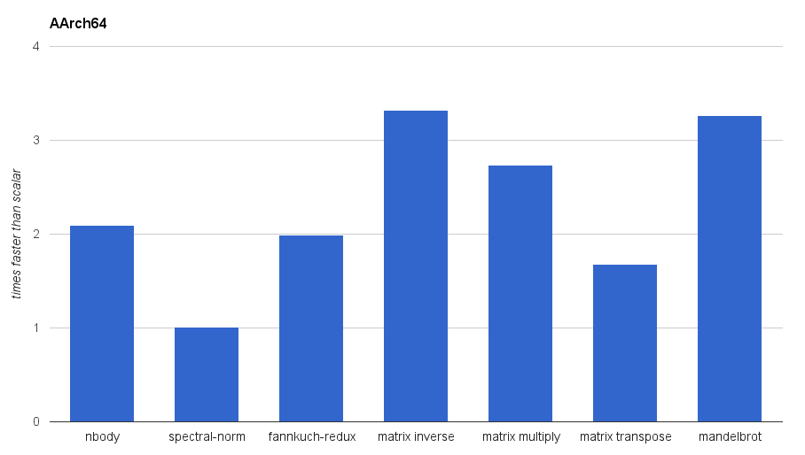
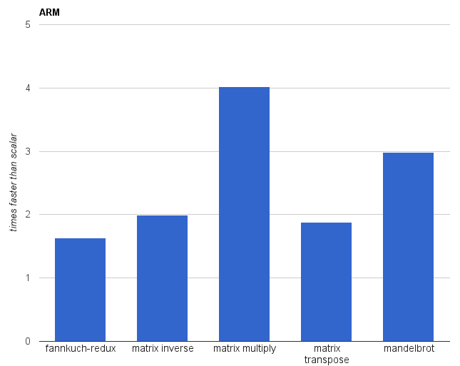

% SIMD in Rust

Huon Wilson

<small>Mozilla Research & University of Sydney</small>

<br>

[<small>huonw.github.io/simd-aug15</small>](http://huonw.github.io/simd-aug15)

# SIMD?

**S**ingle **I**nstruction **M**ultiple **D**ata: Do many number
  things at once.



# <span style='font-size: 0.9em'>Acronyms, Acronyms Everywhere</span>

Non-embedded devices have SIMD:

- **x86**/<strong>x86-64</strong>: SSE, AVX, AVX512 (etc.)
- **ARM**/<strong>AArch64</strong>: NEON, (VFP)
- **PowerPC**: AltiVec
- **MIPS**: MSA, (MDMX, MIPS-3D)
- (**SPARC**: VIS)

# RFC #1199

[</img>](https://github.com/rust-lang/rfcs/pull/1199)

# PR #27169 (et al.)

[</img>](https://github.com/rust-lang/rust/pull/27169)

# `github.com/huonw/simd`

[</img>](https://github.com/huonw/simd)

# Publicity

[</img>](http://huonw.github.io/blog/2015/08/simd-in-rust/)

</img>

# Mandelbrot


# 

```rust
fn mandelbrot(c_x: f32, c_y: f32,
              max_iter: u32) -> u32
{
    let mut x = c_x;
    let mut y = c_y;

    let mut count = 0;
    while count < max_iter {
        let xy = x * y;
        let xx = x * x;
        let yy = y * y;
        let sum = xx + yy;

        if sum > 4.0 { break }

        count += 1;

        x = xx - yy + c_x;
        y = xy + xy + c_y;
    }
    count
}
```

# &times;4

```rust
fn mandelbrot(c_x: f32x4, c_y: f32x4,
              max_iter: u32) -> u32x4
{
    let mut x = c_x;
    let mut y = c_y;

    let mut count = u32x4::splat(0);
    for _ in 0..max_iter as usize {
        let xy = x * y;
        let xx = x * x;
        let yy = y * y;
        let sum = xx + yy;
        let mask = sum.lt(f32x4::splat(4.0));
        if !mask.any() { break }

        count = count + mask.to_i().select(u32x4::splat(1),
                                           u32x4::splat(0));
        x = xx - yy + c_x;
        y = xy + xy + c_y;
    }
    count
}
```

# &times;4: zero overhead

<table class="compare">
<tbody>
<tr><td>
<pre><code>for _ in 0..max_iter as usize {
<div class="group-a">    let xy = x * y;
    let xx = x * x;
    let yy = y * y;</div><div class="group-b">    let sum = xx + yy;</div><div class="group-c">    let mask = sum.lt(f32x4::splat(4.0));</div><div class="group-d">    if !mask.any() {

        break }</div>

<div class="group-e">    count = count + mask.to_i().select(u32x4::splat(1),
                                       u32x4::splat(0));</div><div class="group-f">    x = xx - yy + c_x;</div>

<div class="group-f">    y = xy + xy + c_y;</div>

}</pre></code>
</td><td>
<pre><code>.LBB1_1:
<div class="group-a">    fmul    <span class="args">v7.4s, v5.4s, v5.4s</span>
    fmul    <span class="args">v16.4s, v6.4s, v6.4s</span></div>
<div class="group-b">    fadd    <span class="args">v17.4s, v16.4s, v7.4s</span></div><div class="group-c">    fcmgt   <span class="args">v17.4s, v3.4s, v17.4s</span></div><div class="group-d">    umaxv   <span class="args">s18, v17.4s</span>
    fmov    <span class="args">w9, s18</span>
    cbz     <span class="args">w9, .LBB1_3</span></div><div class="group-a">    fmul    <span class="args">v6.4s, v6.4s, v5.4s</span></div>    add     <span class="args">x8, x8, #1</span>
<div class="group-e">    and     <span class="args">v5.16b, v17.16b, v4.16b</span></div>
<div class="group-f">    fsub    <span class="args">v7.4s, v7.4s, v16.4s</span></div><div class="group-e">    add     <span class="args">v2.4s, v5.4s, v2.4s</span></div><div class="group-f">    fadd    <span class="args">v5.4s, v7.4s, v0.4s</span>
    fadd    <span class="args">v6.4s, v6.4s, v6.4s</span>
    fadd    <span class="args">v6.4s, v6.4s, v1.4s</div>    cmp     <span class="args">x8, #100</span>
    b.lo    <span class="args">.LBB1_1</span></code></pre>
</td>
</tr>
<tbody>
</table>

# Benchmarks...

2.4&times; faster, on average.



# Benchmarks... everywhere

2.1&times; faster, on average.



# Benchmarks... everywhere<sup>2</sup>

2.4&times; faster, on average.



# Future

- More platforms
- More comprehensive support in `simd`
- More libraries
- Dynamic SIMD feature dispatch (choose between `foo_avx`,
  `foo_sse41`, `foo_sse2`, etc.)
